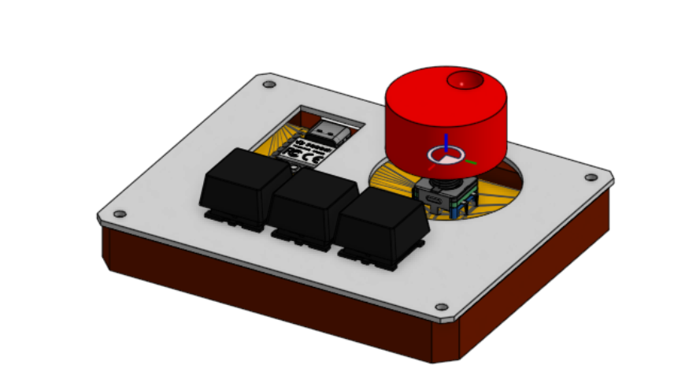
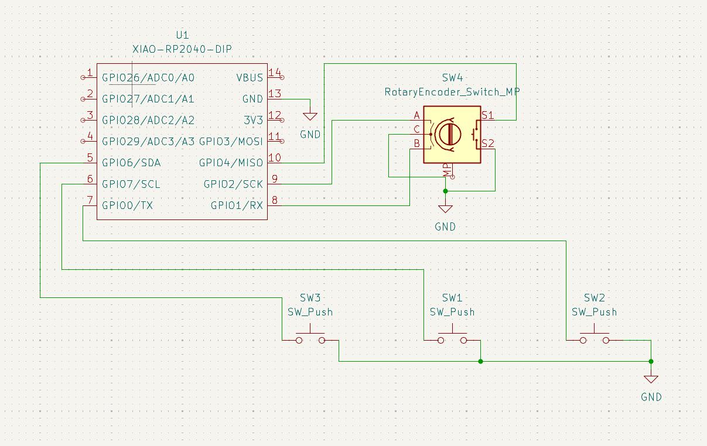
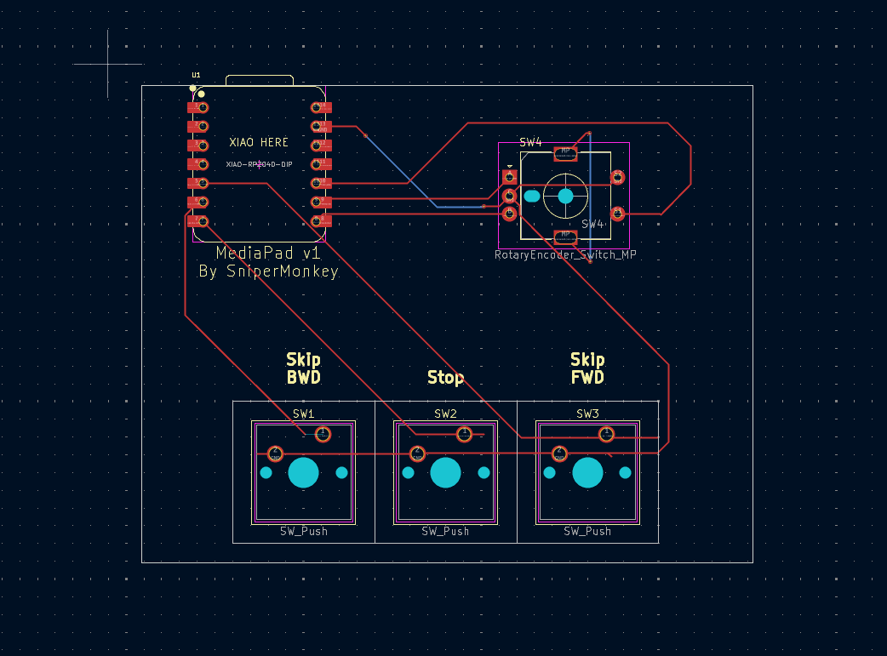
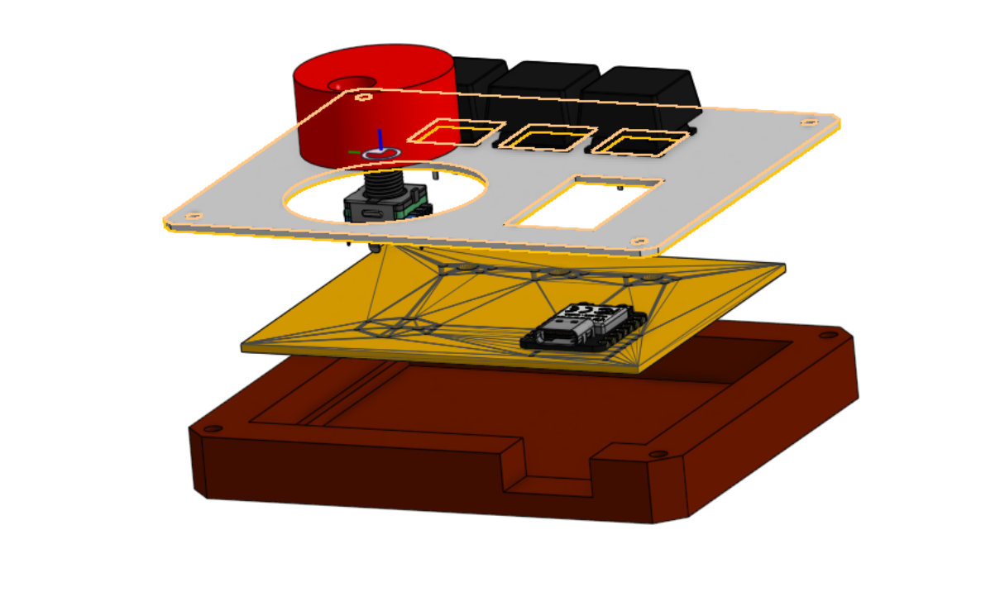

# mediaPad

This is my submission for hackpad. It's a macropad centered around media control, a mediaPad!
# Features
- 3 keyboard buttons
- One EC11 rotary encoder with a press button
- control of volume, pause/play, stop, skip forward, skip backward.

# PCB & Schematic

This was my first time using kiCAD or any PCB/Schematic design software.
It was unexpectedly pretty easy and the features were a lot more advanced that I was expecting. 

# CAD
This all fit's together with four m3 bolts & nuts that I will supply myself.

# BOM
- 1 XIAO RP2040
- 4x cherry mx red
- 4x DSA Keycaps
- 4x M3x16mm Bolts
- 4x M3 Nylock Nuts
- 1x EC11 Rotary Encoder
- 1x Case (2 3D printed parts)
